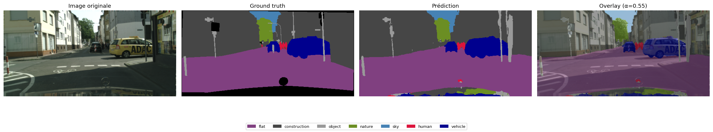
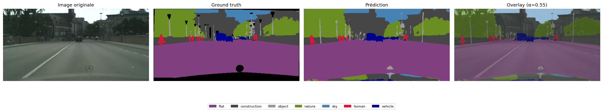
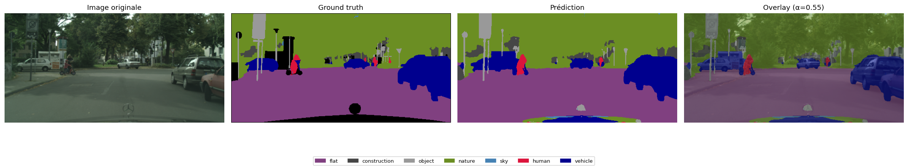

# Road Segmentation — Cityscapes

Semantic segmentation of urban driving scenes. UNet + EfficientNet-B4 encoder trained on [Cityscapes](https://www.cityscapes-dataset.com/), 8 classes, **0.836 mIoU**.

---

## Demo

<table>
  <tr>
    <td></td>
  </tr>
  <tr>
    <td></td>
  </tr>
</table>

*Left: original frame — Right: segmentation overlay (α = 0.5)*

---

## Results

| Class | IoU |
|---|---|
| flat | 0.965 |
| construction | 0.869 |
| nature | 0.878 |
| sky | 0.907 |
| vehicle | 0.877 |
| human | 0.621 |
| object | 0.521 |
| **mean** | **0.836** |

Trained for 22 epochs · EfficientNet-B4 encoder · 1024×512 · Colab A100

---

## Examples





---

## Quick Start

**1. Preprocess** *(run once locally)*
```bash
python scripts/preprocess.py \
  --data_root /path/to/cityscapes \
  --output_dir /path/to/preprocessed \
  --width 1024 --height 512
```

**2. Train** *(Colab)*

Open [`notebooks/train_colab.ipynb`](notebooks/train_colab.ipynb), upload the zipped preprocessed data to Drive, run all cells.

**3. Inference on video**
```bash
python scripts/infer_video.py \
  --checkpoint path/to/best.pth \
  --frames_dir path/to/frames/ \
  --output     path/to/output.mp4
```

---

## Architecture

| | |
|---|---|
| Model | UNet |
| Encoder | EfficientNet-B4 (ImageNet pretrained) |
| Loss | 0.5 × CrossEntropy + 0.5 × Dice |
| Optimizer | AdamW + cosine warmup |
| Input | 1024×512 |
| Classes | 8 (flat · construction · object · nature · sky · human · vehicle) |

---

## Class Palette

<table>
  <tr>
    <td align="center"> flat</td>
    <td align="center"> construction</td>
    <td align="center"> object</td>
    <td align="center"> nature</td>
    <td align="center"> sky</td>
    <td align="center"> human</td>
    <td align="center"> vehicle</td>
  </tr>
</table>
