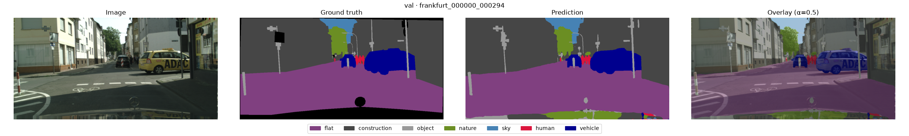
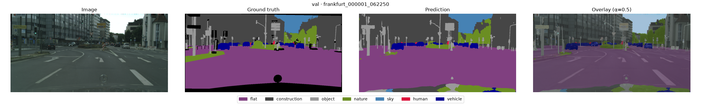
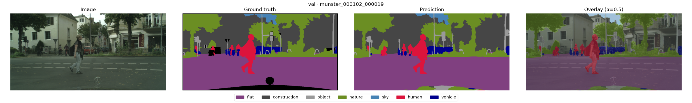

# Road Segmentation — Cityscapes

Semantic segmentation of urban driving scenes. UNet + EfficientNet-B4 encoder trained on [Cityscapes](https://www.cityscapes-dataset.com/) at 1024×512, predicting the **7 Cityscapes categories** (flat · construction · object · nature · sky · human · vehicle): **0.886 mIoU** on the val split.

> These are *category-level* results (7 coarse groups), not the standard 19-class Cityscapes benchmark, which is a much harder task. The two sets of numbers are not comparable.

---

## Demo

<table>
  <tr>
    <td></td>
  </tr>
  <tr>
    <td></td>
  </tr>
</table>

*Left: original frame — Right: segmentation overlay (α = 0.5). Cityscapes `demoVideo` sequences, generated with an intermediate checkpoint of the training run (≈ epoch 22). Stuttgart is one of the training cities (the demo frames themselves are not in the training set).*

---

## Results

<!--
  Regenerate this section from results/metrics.json, produced by:
    python scripts/evaluate.py --checkpoint best.pth --data_root /path/to/preprocessed \
        --examples_dir assets/examples
  The script prints the Markdown table below.
-->

| Class | IoU |
|---|---|
| flat | 0.985 |
| construction | 0.922 |
| object | 0.694 |
| nature | 0.920 |
| sky | 0.943 |
| human | 0.811 |
| vehicle | 0.928 |
| **mean** | **0.886** |

Pixel accuracy 0.970 · 500 val images · EfficientNet-B4 · 1024×512 · trained 50 epochs, checkpoint from epoch 49 (best val score) · Colab A100 · raw output in [`results/metrics.json`](results/metrics.json)

### How the metric is computed

- **Dataset-level mIoU**: one confusion matrix is accumulated over all 500 val images, then IoU = TP / (TP + FP + FN) per class, averaged over the 7 categories (`src/metrics.py`). This is the Cityscapes convention; it is *not* an average of per-image or per-batch scores.
- Evaluated on the **val split** at 1024×512 (labels downsampled with nearest-neighbour). Cityscapes test labels are not public, so val is also what was used to pick the best epoch and to tune the class weights — treat the numbers as slightly optimistic.
- Pixels labelled *void* in the ground truth (ego vehicle, rectification border, …) are ignored.

---

## Examples

Evenly spaced images from the val set (not hand-picked), generated by `scripts/evaluate.py --examples_dir assets/examples`.





---

## Quick Start

```bash
pip install -r requirements.txt
```

**1. Preprocess** *(run once locally)*
```bash
python scripts/preprocess.py \
  --data_root /path/to/cityscapes \
  --output_dir /path/to/preprocessed \
  --width 1024 --height 512
```

**2. Train** *(Colab)*

Open [`notebooks/train_colab.ipynb`](notebooks/train_colab.ipynb), set `REPO_URL`, upload the zipped preprocessed data to Drive, run all cells. Each run writes `best.pth`, `last.pth`, `history.csv` (per-epoch losses and IoUs) and `metrics.json` to its own Drive folder.

**3. Evaluate**
```bash
python scripts/evaluate.py \
  --checkpoint path/to/best.pth \
  --data_root  path/to/preprocessed
```

**4. Inference on video**
```bash
python scripts/infer_video.py \
  --checkpoint path/to/best.pth \
  --frames_dir path/to/frames/ \
  --output     path/to/output.mp4
```

**Tests**
```bash
pytest
```

---

## Architecture

| | |
|---|---|
| Model | UNet |
| Encoder | EfficientNet-B4 (ImageNet pretrained) |
| Loss | 0.5 × CrossEntropy (object & human weighted ×3) + 0.5 × Dice |
| Optimizer | AdamW + cosine schedule with 5-epoch warmup |
| Input | 1024×512 |
| Outputs | 8 channels: the 7 categories + an unused *void* channel (void pixels are ignored in the loss and metric) |

---

## Class Palette

<table>
  <tr>
    <td align="center"> flat</td>
    <td align="center"> construction</td>
    <td align="center"> object</td>
    <td align="center"> nature</td>
    <td align="center"> sky</td>
    <td align="center"> human</td>
    <td align="center"> vehicle</td>
  </tr>
</table>
